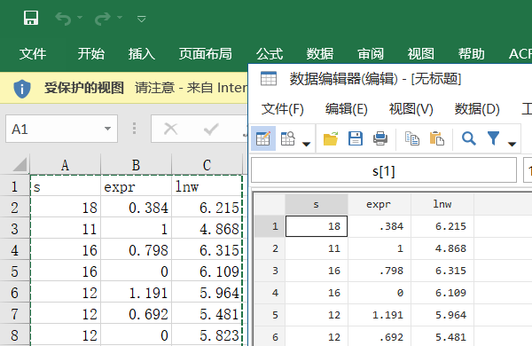
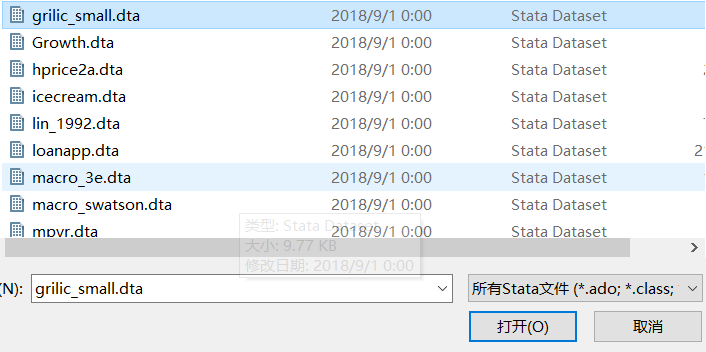
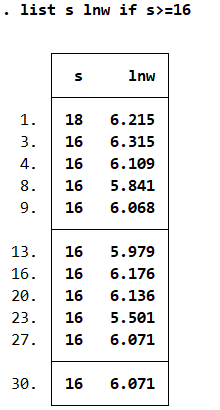
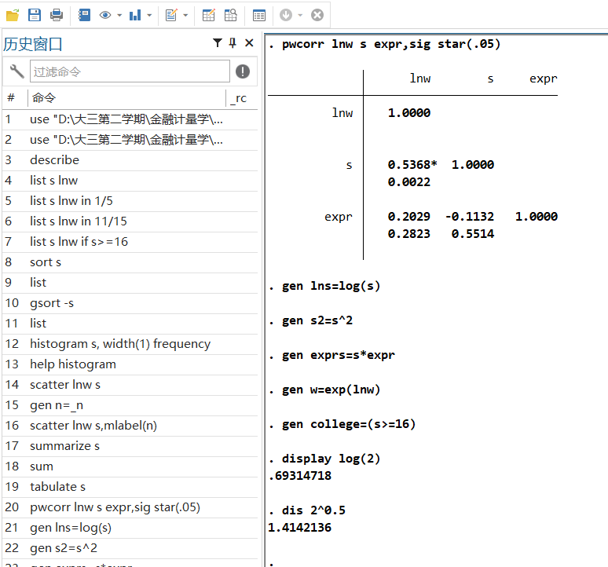
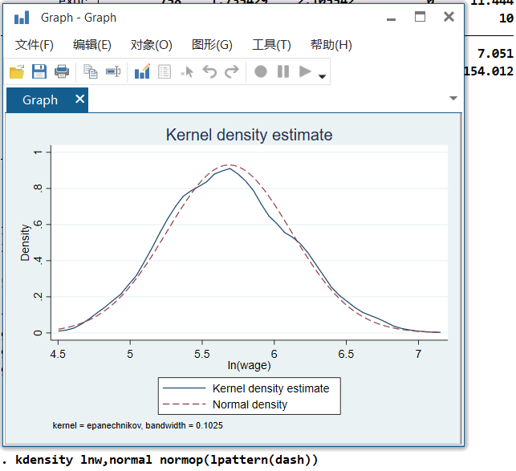

<h1><center>Stata使用教程</center></h1>

#### 1、导入数据

##### 数据编辑器导入：



##### 菜单点击导入：


##### 导入Stata数据集：

###### 	1、Open：

##### 

###### 2、代码输入：

```
use "D:\大三第二学期\金融计量学\数据\grilic_small.dta", clear
```


#### 2、变量编辑器

可以在变量编辑器中更改变量的标签等属性


#### 3、描述和操作导入的数据

描述所有导入的数据：

```
describe
```


列出需要查看的数据：

```
#列出s和lnw
list s lnw
#列出s和lnw的前5个数据
list s lnw in 1/5
#列出s和lnw的11到15个值
list s lnw in 11/15
#列出s大于等于16的数据
list s lnw if s>=16
#删除数据（未输入）
drop if s>=16
#保留数据（未输入）
keep if s>=16
#升序排序
sort s
list
#降序排序
gsort -s
list
```





#### 4、画图

```
#画直方图
histogram s, width(1) frequency
#查看histogram的用法
help histogram
#画s和lnw的散点图
scatter lnw s
#标注每个点对应的观测值
gen n=_n
scatter lnw s,mlabel(n)
```


#### 5、统计分析

```
#s的统计特征
summarize s
#所有的变量的统计分析
sum
#s的经验累积分布函数
tabulate s
#s、lnw和expr的相关系数
pwcorr lnw s expr,sig star(.05)
```


#### 6、生成新变量

```
#定义教育年限的对数
gen lns=log(s)
#定义s的平方项
gen s2=s^2
#生成s与expr的互动项
gen exprs=s*expr
#根据工资对数lnw计算工资水平w
gen w=exp(lnw)
#定义s>=16为受过高等教育，使用college来表示
gen college=(s>=16)
#可用rename命令更改变量名(未输入)
rename college coll
#删除college重新定义为15开始
drop college
gen college=(s>=15)
#或者(未输入)
replace college=(s>=15)
```


#### 7、计算器功能

```
#计算ln2
display log(2)
#计算根号2
dis 2^0.5
```


#### 8、调用命令和终止命令

从历史中调用或者键盘Page up or down

点击×终止运行



#### 9、Stata日志

如图导出log或者命令行

```
log using today
#暂时关闭日志
log off
#恢复使用日志
log on
#彻底退出日志
log close
```


#### 10、使用实例

```
#打开数据集，查看变量
use "D:\大三第二学期\金融计量学\数据\grilic.dta", clear
describe
#查看各指标的统计指标
sum
#查看更多指标
sum lnw,detail
#画lnw的直方图
hist lnw,width(0.1)
#核密度估计
kdensity lnw,normal normop(lpattern(dash))
#考察工资水平本身
gen wages=exp(lnw)
kdensity wages
#给定教育年限的工资对数条件密度
kdensity lnw if s==16
#将lnw的无条件密度和条件密度画在一起
twoway kdensity lnw || kdensity lnw if s==16,lpattern(dash)
#上述等价实现
twoway (kdensity lnw) (kdensity lnw if s== 16,lpattern(dash))
#比较s=12(中学毕业)与s=16(大学毕业)情况下，lnw的条件密度
twoway (kdensity lnw if s==12) (kdensity lnw if s==16,lpattern(dash))
#计算rns=0时,lnw的条件期望
sum lnw if rns==0
#计算rns=1时,lnw的条件期望
sum lnw if rns==1
#以南北方的局面占比作为权重，计算北方南方的平均工资对数
dis 5.725644*(554/(554+204))+5.581083*(204/(554+204))
#计算无条件期望
sum lnw
#计算标准正态变量小于1，96的概率
dis normal(1.96)
#画标准正态分布的密度函数
twoway function y=normalden(x),range(-5 5) xline(0) ytitle(概率密度)
#将N(0,1)和N(1,4)的密度函数画在一起
twoway function y=normalden(x),range(-5 10) || function z = normalden(x,1,2),range(-5 10) lpattern(dash) ytitle(概率密度)
#将卡方分布k=3和5的密度函数画在一起
twoway function chi3=chi2den(3,x),range(0 20)||function chi5=chi2den(5,x),range(0 20) lpattern(dash) ytitle(概率密度)
#将t(1)与t(5)的密度函数画在一起
twoway function t1=tden(1,x),range(-5 5) || function t5=tden(5,x),range(-5 5) lpattern(dash) ytitle(概率密度)
#F(10,20)和F(10,5)的密度函数画在一起
twoway function F20=Fden(10,20,x),range(0 5) || function F5=Fden(10,5,x),range(0 5) lpattern(dash) ytitle(概率密度)
```





